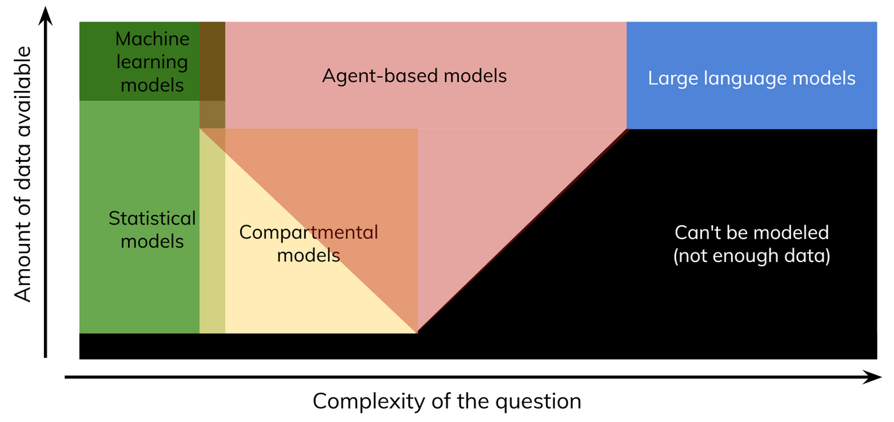

## Introduction

Starsim is a framework for modeling the spread of diseases among agents via dynamic transmission networks. Starsim supports:

- Co-transmission of multiple diseases at once, capturing how they interact biologically and behaviorally
- Non-infectious diseases, either on their own or as factors affecting the transmission or mortality of infectious diseases
- Detailed modeling of mother-child relationships starting from conception, allowing investigation of infant and childhood diseases
- Multiple types of transmission network, including theoretical (e.g. Erdős–Rényi) and realistic (e.g. age-assortative sexual partnerships)
- Different intervention types, such as vaccines or treatments, and showing their impact through different delivery methods such as mass campaigns or targeted outreach
- Automated calibration to data, plus careful handling of random numbers to minimize variance between simulations

Starsim is available for both Python and R, and is fully open-source under the MIT license.

## Types of disease modeling

Starsim is primarily an agent-based model (ABM), although it can also be used for compartmental and metapopulation modeling. ABMs are most suitable for questions that are moderately complex, and have medium to large amounts of data available:

For simpler questions, statistical or compartmental models are often all that's needed. For very complex questions, LLMs (which themselves might be trained on agent-based model outputs) may be more suitable. Examples of each type of question are:

- **Statistical models**: "Are people who received the vaccine less likely to get infected?"
- **Machine learning models**: "What behavioral factors influence vaccination uptake?"
- **Compartmental models**: "What is disease prevalence going to be in 5 years given 100% vaccine uptake?"
- **Agent-based models**: "What is disease prevalence going to be in 5 years given realistic assumptions about screening and vaccine coverage?"

## Why Starsim?

Starsim aims to address the limitations of existing ABMs, specifically along the dimensions of usability, capability, and outcome:

| Dimension | Starsim | Status quo |
|----------|----------|----------|
| Usability   | Starsim is fast, has a simple interface, and only requires knowledge of Python   | Many ABMs are slow, complex, or require knowledge of C++/Java   |
| Capability   | Starsim supports multiple custom diseases and networks, including co-transmission   | Most other disease models are single-disease or hard-coded to a handful of diseases   |
| Outcome   | Once you've collected your data, modeling your questions with Starsim takes days to weeks   | Writing, testing, and calibrating a custom model can take months to years   |

While of course not all existing ABMs have these limitations, many of them have at least one. (For a good review of general-purpose ABMs, see [Antelmi et al. 2023](https://www.mdpi.com/2076-3417/13/1/13)).

## Starsim principles

Starsim's design philosophy has two parts. First, "**Common tasks should be simple**". Examples include:

- Defining parameters
- Running a simulation
- Plotting results

These are things you need to do in every single Starsim analysis, so we've tried to make them as easy as possible.

The second part of the philosophy is "**Custom tasks can't always be simple, but they should still be possible**". Examples include:

- Introducing a new vaccine
- Implementing a new disease
- Writing a custom calibration function

If you're implementing a complicated disease, there will always be some irreducible complexity involved in that. Starsim's job is to help you where it can, but then get out of the way and let you write your code.

## Should I use Starsim?

Starsim is suitable for many use cases, but not all. Some examples of suitable Starsim use cases are:

- If you are currently doing agent-based modeling but your model is too slow/inflexible/hard to use for your research questions
    - *Example*: Your model takes 14 hours for a single run, and every year you're worried that your computing grant won't be renewed
- If you are currently doing compartmental modeling, and want to try out an agent-based model without investing 3-6 months learning how to use it
    - *Example*: Your compartmental mpox model has so far been very effective, but you've been asked to evaluate an individually-targeted intervention that requires tracking individual agents
- If you want to quickly prototype different diseases or networks before deciding whether to implement them in your full model
    - *Example*: You know and love your HIV model, but you want to see what the impact would be of including syphilis co-transmission or a different type of MSM network

However, there are other cases where Starsim may not be suitable. These include:

- If compartmental models are sufficient for your questions, you should probably stick with them. Starsim can do compartmental modeling, but this is most powerful if used in a hybrid manner with agents (for example, modeling malaria as agent-based humans and compartmental mosquitoes). Other options for compartmental models are [Epidemics](https://epiverse-trace.r-universe.dev/epidemics) for R, and [Atomica](https://atomica.tools) or [Epydemix](https://www.epydemix.org/) for Python. Note that it is relatively easy to switch between modeling frameworks; the user guide includes an example of an [Epidemics school closure model](https://docs.starsim.org/user_guide/advanced_nonstandard.html#epiverse-epidemics-school-closure-model) reimplemented in Starsim. [Starsim-AI](https://ai.starsim.org) includes tools for automatically translating different types of models into Starsim format.
- If your current model is highly specialized to a given context, the switching cost of moving to Starsim may not be worthwhile (though as noted, AI tools have made this much easier than it used to be, so get in touch if this is of interest to you).

