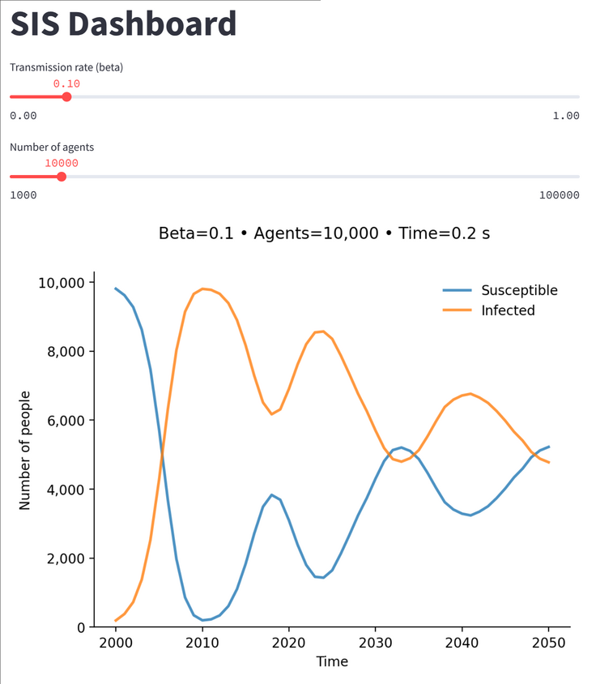

Since Starsim is implemented in pure Python, it can easily be deployed on the cloud. Here we describe some different approaches for doing this.

## Virtual machine

One of the most common approaches is to run Starsim on a single large virtual machine (VM). By default, `ss.MultiSim` (and `ss.parallel()`) will use all available cores. If your script already makes use of these, then you don't need to make any more changes:


```{python}
import sciris as sc
import starsim as ss
ss.options(jupyter=True)

base_pars = sc.objdict(
    n_agents = 10e3,
    diseases = sc.objdict(
        type = 'sis',
        beta = 0.1,
    ),
    networks = 'random',
    rand_seed = 1,
    verbose = False,
)

# Generate sims in serial
sims = sc.autolist() # Can also just use []
for i in range(10):
    pars = base_pars.copy()
    pars.diseases.beta *= sc.perturb()
    pars.rand_seed = i
    sim = ss.Sim(pars)
    sims += sim

# Run in parallel
msim = ss.parallel(sims)
msim.plot(legend=False)
```

Note that this example uses `sc.objdict()` rather than `dict()` -- either work, but it means you can use `pars.diseases.beta` rather than `pars['diseases']['beta']`. You could also create full Starsim objects (e.g. `diseases = ss.SIS()` and then modify `pars.diseases.pars.beta`).

In some cases, creating the sim is itself a time-consuming step (especially if hundreds or thousands are being generated). In this case, you can write a `make_sim()` function and parallelize that too:

```{python}
def make_sim(i, pars):
    pars.diseases.beta *= sc.perturb() # Don't need to copy pars since implicitly copied via the pickling process
    pars.rand_seed = i
    sim = ss.Sim(pars)
    return sim

sims = sc.parallelize(make_sim, range(10), pars=base_pars, serial=False)
msim = ss.parallel(sims)
msim.plot(legend=False)
```

Note that parallelizing the build process pickles and unpickles the sims, which can be an expensive operation. `make_sim()` functions can often get quite complicated, so it's often good software engineering practice to separate them out anyway. You can use the `serial=True` argument of Sciris' `sc.parallelize()` function (which is what `ss.parallel()` calls under the hood) in order to run in serial, to see if it's the same speed or faster.

<div class="alert alert-block alert-info">    
While the traditional way to run on a VM is via SSH and terminal, it is also possible to run remotely via <a href="https://marketplace.visualstudio.com/items?itemName=ms-vscode-remote.remote-ssh">VS Code</a> (and Cursor etc.), <a href="https://www.jetbrains.com/help/pycharm/configuring-remote-interpreters-via-ssh.html">PyCharm</a>, or <a href="https://docs.spyder-ide.org/current/panes/ipythonconsole.html#connect-to-a-remote-kernel">Spyder</a>. You can also run a Jupyter server on the VM and access it that way  (we like <a href="https://tljh.jupyter.org/">The Littlest JupyterHub</a>).
</div>

## Dask and Coiled

Adapting the examples above, we can fairly easily make Starsim simulations run using other popular tools such as [Dask](https://docs.dask.org/) and [Joblib](https://joblib.readthedocs.io/). Here's a Dask example:

```{python}
import dask
import dask.distributed as dd
import numpy as np
import starsim as ss


def run_sim(index, beta):
    """ Run a standard simulation """
    label = f'Sim {index}, beta={beta:n}'
    sis = ss.SIS(beta=beta)
    sim = ss.Sim(label=label, networks='random', diseases=sis, rand_seed=index, verbose=False)
    sim.run()
    sim.shrink() # Remove People and other states to make pickling faster
    return sim


if __name__ == '__main__':

    # Run settings
    n = 8
    n_workers = 4
    betas = 0.1*np.sort(np.random.random(n))

    # Create and queue the Dask jobs
    client = dd.Client(n_workers=n_workers)
    queued = []
    for i,beta in enumerate(betas):
        run = dask.delayed(run_sim)(i, beta)
        queued.append(run)

    # Run and process the simulations
    sims = list(dask.compute(*queued))
    msim = ss.MultiSim(sims)
    msim.plot()
```

[Coiled](https://coiled.io/), which is a paid service by Dask that allows auto-scaling across clusters, has a similar syntax:

```py
import sciris as sc
import starsim as ss
import coiled
import dask.distributed as dd

# Parameters
n_workers = 50
n = 1000

def run_sim(seed):
    sim = ss.Sim(n_agents=100e3, dur=100, diseases='sis', networks='random', rand_seed=seed)
    sim.run().shrink()
    return sim

# Set up cluster
cluster = coiled.Cluster(n_workers=n_workers, workspace="<your_coiled_workspace>")
client = cluster.get_client()

# Set up futures
futures = []
for seed in range(n):
    future = client.submit(run_sim, seed)
    futures.append(future)

# Run
sims = client.gather(futures)

# Plot
msim = ss.MultiSim(sims)
msim.plot()
```

(Note: You will need a Coiled subscription to run this example.)

## Interactive dashboards

Another common desire is to make interactive dashboards. There are many ways to do this, including [Shiny for Python](https://shiny.posit.co/py/), [Voila](https://voila.readthedocs.io/), and [Panel](https://panel.holoviz.org/), but the simplest is probably [Streamlit](https://streamlit.io/):

```py
import streamlit as st
import starsim as ss

def run_sim(beta, n_agents):
    sis = ss.SIS(beta=beta)
    sim = ss.Sim(
        n_agents = n_agents,
        diseases = sis,
        networks = 'random',
    )
    sim.run()
    sim.label = f'Beta={beta:n} • Agents={n_agents:,} • Time={sim.timer.total:0.1f} s'
    return sim

# Create the Streamlit interface
st.title('SIS Dashboard')
beta = st.slider('Transmission rate (beta)', 0.0, 1.0, 0.1)
n_agents = st.slider('Number of agents', 1_000, 100_000, 10_000)

# Run simulation and plot results
sim = run_sim(beta, n_agents)
fig = sim.diseases.sis.plot()
fig.suptitle(sim.label)
st.pyplot(fig)
```

This example is saved in this folder as `streamlit.py`, and (after `pip install streamlit`) can be run with `streamlit run streamlit.py`. This should give something like this:



